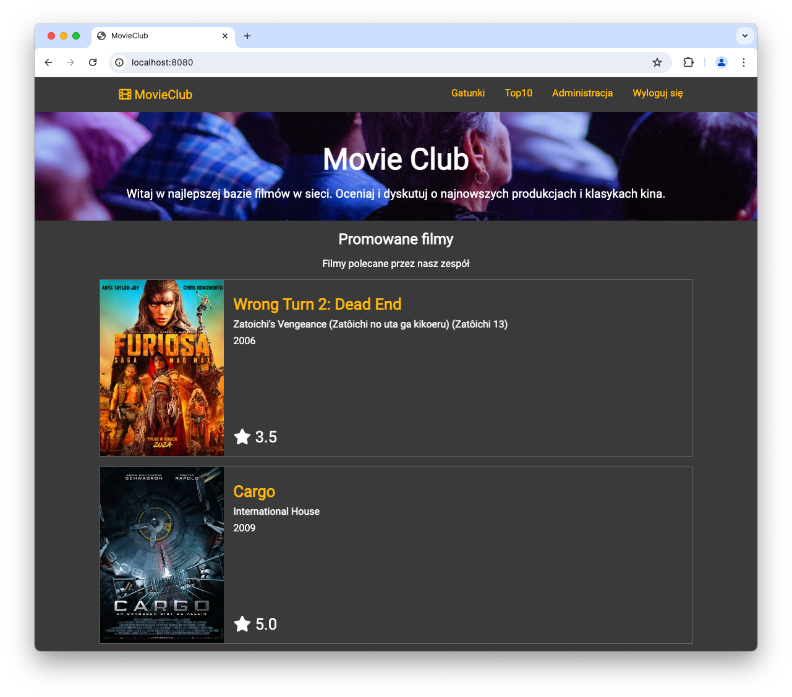
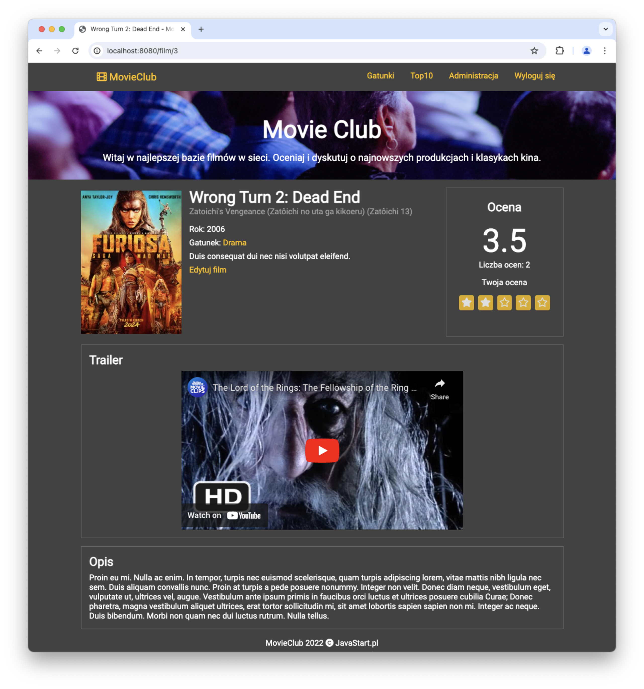
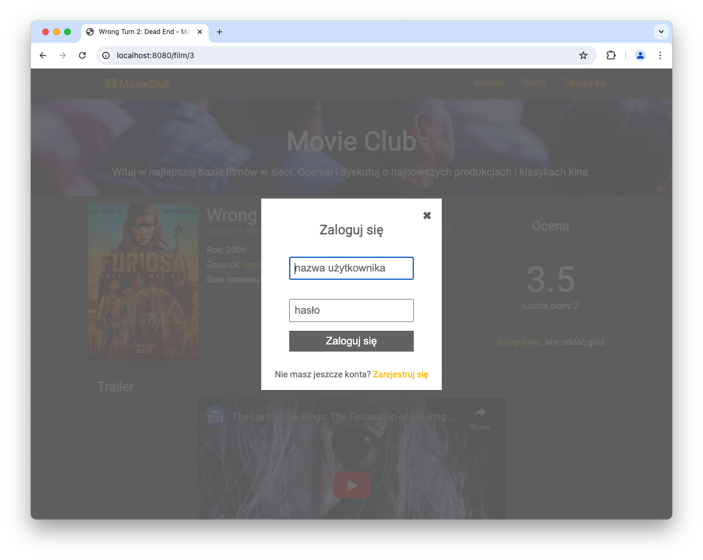

# MovieClub

Demo webapp with Spring Boot 3 stack.

If you want to create it step by step, you will find instructions in my tutorial on https://javastart.pl/kurs/spring

## Tech Stack

Frontend: Thymeleaf, webjars, HTML, SCSS, Flexbox, JS and HTMX

Webapp: Spring Boot 3 (web, security)

Persistence: JPA and Spring Data with multiple profiles for H2 and MySQL and Liquibase for schema migrations

Deployment: Java 17, jar packaging with embedded server, Docker with Docker Compose 

## How to run this app

If you use IntelliJ IDEA, there are run configurations provided in `.run` directory.
Use compound run configuration `movieclub [debug with sass-watch]` to run application with sass-watch in background.

For other IDE's run `pl.javastart.movieclub.MovieclubApplication` and then `mvn dart-sass:watch-sass`

## Demo

https://movieclub.ludigi.com/

## Screenshots

